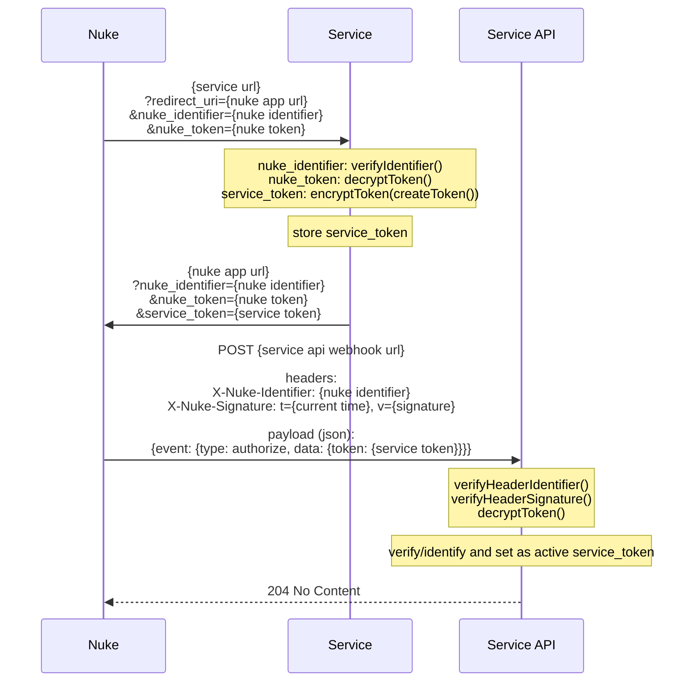

# nuke-php

```mermaid
sequenceDiagram
    participant nuke as Nuke
    participant service as Service
    participant service_api as Service API

    nuke ->> service: {service url}<br>?redirect_uri={nuke app url}<br>&nuke_identifier={nuke identifier}<br>&nuke_token={nuke token}

    note over service: nuke_identifier: verifyIdentifier()<br>nuke_token: decryptToken()<br>service_token: encryptToken(createToken())

    note over service: store service_token

    service ->> nuke: {nuke app url}<br>?nuke_identifier={nuke identifier}<br>&nuke_token={nuke token}<br>&service_token={service token}

    nuke ->> service_api: POST {service api webhook url}<br><br>headers:<br>X-Nuke-Identifier: {nuke identifier}<br>X-Nuke-Signature: t={current time}, v={signature}<br><br>payload (json):<br>{event: {type: authorize, data: {token: {service token}}}}

    note over service_api: verifyHeaderIdentifier()<br>verifyHeaderSignature()<br>decryptToken()

    note over service_api: verify/identify and set as active service_token

    service_api -->> nuke: 204 No Content
```
