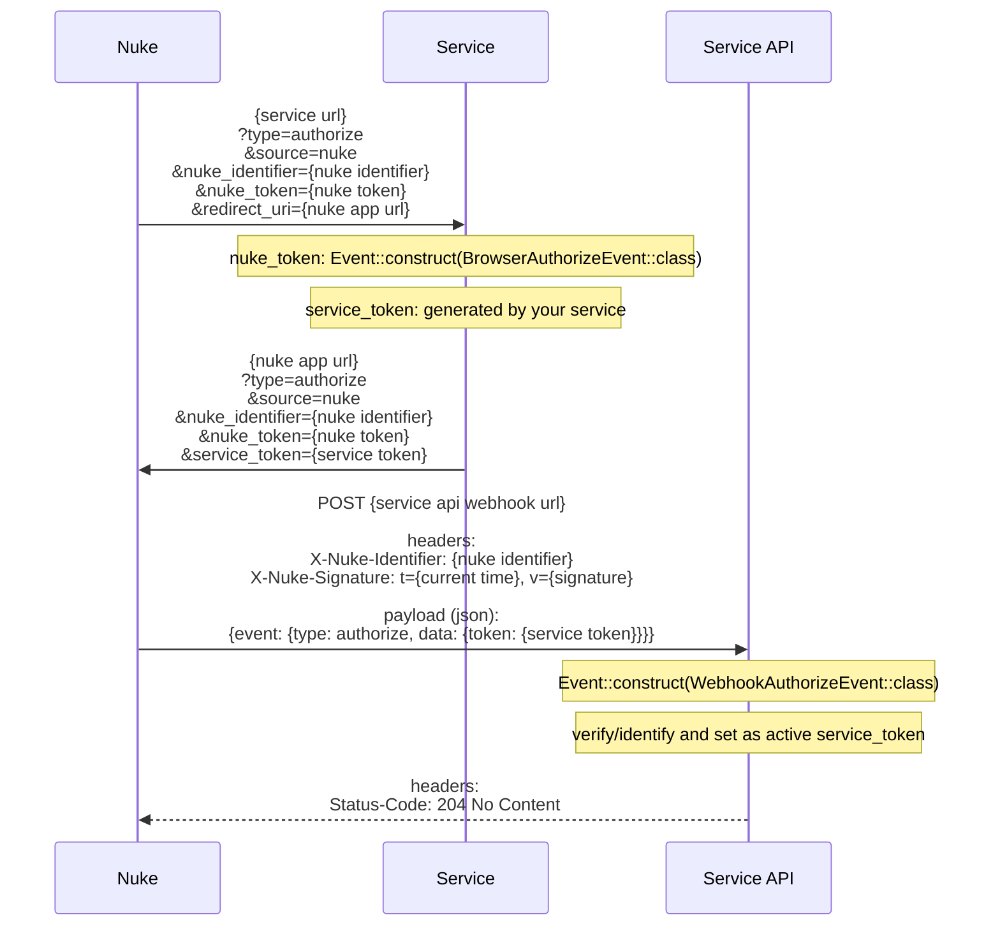
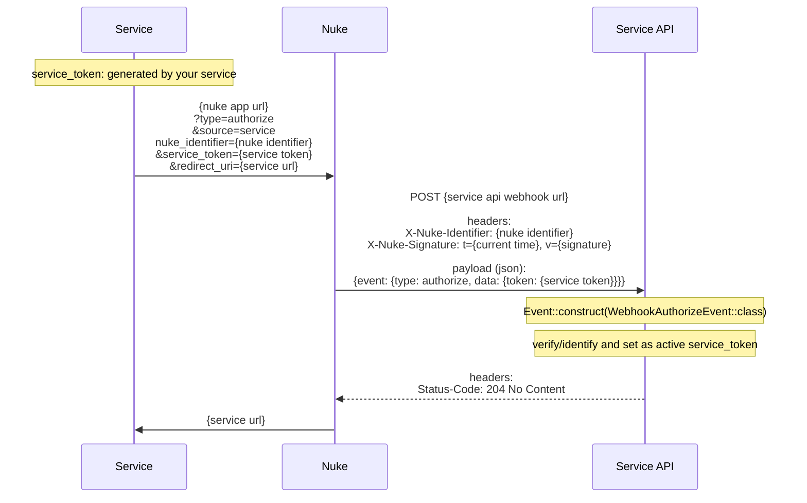
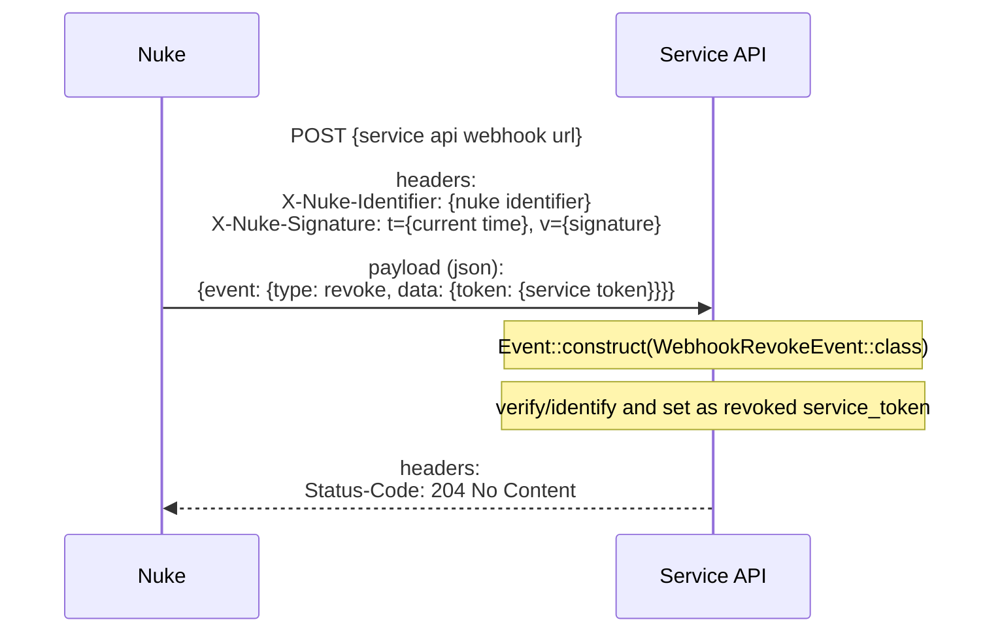
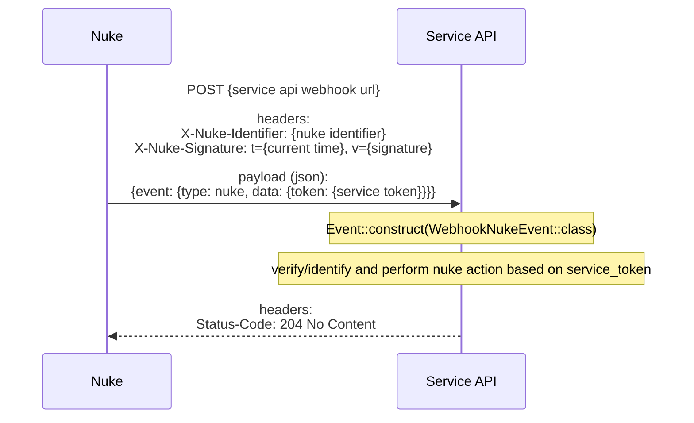

# nuke-php

## Domain Verify

- .well-known file
    ```mermaid
    sequenceDiagram
        participant nuke as Nuke
        participant service as Service Domain
    
        note over service: create {your service domain}/.well-known/nuke-verify/{nuke token}<br><br>payload:<br>{nuke token}
    
        nuke ->> service: GET {your service domain}/.well-known/nuke-verify/{nuke token}
    
        service -->> nuke: headers:<br>Status-Code: 200 OK<br><br>payload:<br>{nuke token}
    
        note over service: delete {your service domain}/.well-known/nuke-verify/{nuke token}
    ```
- DNS
    ```mermaid
    sequenceDiagram
        participant nuke as Nuke
        participant service as Service Domain
    
        note over service: create TXT DNS for _nuke_verify.{your service domain}<br><br>payload:<br>{nuke token}
    
        nuke ->> service: CHECK TXT DNS _nuke_verify.{your service domain} for {nuke token}
    
        service -->> nuke: Domain is verified
    
        note over service: delete TXT DNS for _nuke_verify.{your service domain}
    ```

## Browser & Webhook Authorize Event

### Nuke > Service > Nuke



### Service > Nuke > Service



## Webhook Revoke Event



## Webhook Nuke Event


